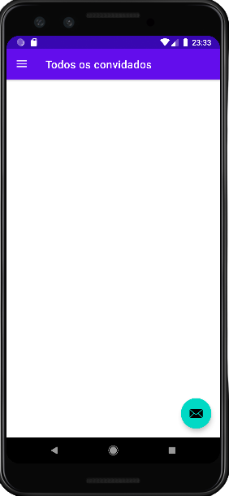
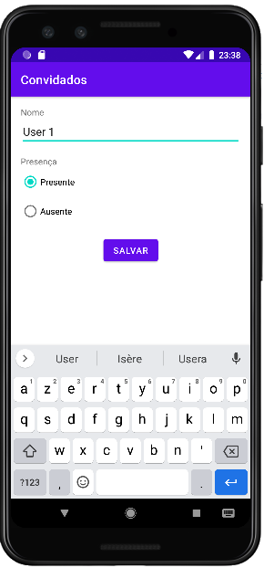
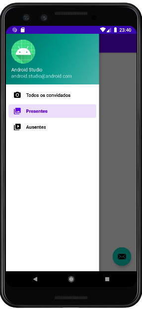

## Guest App

 

This application is the result of Kotlin's studies. His goal is to make a C.R.U.D of guests

    - Kotlin 1.8.0
    - Java 11.0.+

Adroid API:

    PIXEL 3 - API 27

The choice of API 27 was based on the number of devices available to run the application.

---

     To insert a guest just click on the icon next
    

---

---

## Opening Application

    To open and run the application, just access it in Android Studio using the 'file' and 'open' option, 
    then just access the folder where the project was saved.Gradle will automatically download the project's dependencies.